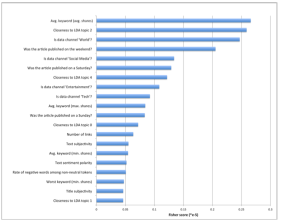
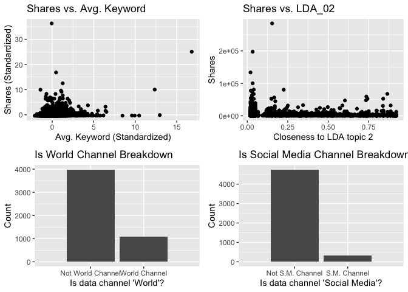

ST558 R Project II
================
Mana Azizsoltani
October 16, 2020

  - [Introduction](#introduction)
  - [Data](#data)
  - [Summarization](#summarization)
  - [Modeling](#modeling)

# Introduction

## Online News Data Set

The online news data set that we will be working with for this project
was found on the UCI Machine Learning Repository. The data itself comes
from the popular online news website, Mashable. Each observation of the
data set represents a single article released by Mashable during the
period from January 7, 2013 and January 7, 2015. Each of the 39644
articles has 60 attributes that describes the different aspects of each
article.

## Variable Descriptions

The variables that I will be using are the following (more on selection
later):

1.  num\_hrefs: Number of links  
2.  data\_channel\_is\_entertainment: Is data channel ‘Entertainment’?  
3.  data\_channel\_is\_socmed: Is data channel ‘Social Media’?  
4.  data\_channel\_is\_tech: Is data channel ‘Tech’?  
5.  data\_channel\_is\_world: Is data channel ‘World’?  
6.  kw\_min\_min: Worst keyword (min. shares)  
7.  kw\_min\_avg: Avg. keyword (min. shares)  
8.  kw\_max\_avg: Avg. keyword (max. shares)  
9.  kw\_avg\_avg: Avg. keyword (avg. shares)  
10. LDA\_00: Closeness to LDA topic 0  
11. LDA\_01: Closeness to LDA topic 1  
12. LDA\_02: Closeness to LDA topic 2  
13. LDA\_04: Closeness to LDA topic 4  
14. global\_subjectivity: Text subjectivity  
15. global\_sentiment\_polarity: Text sentiment polarity  
16. rate\_negative\_words: Rate of negative words among non-neutral
    tokens  
17. title\_subjectivity: Title subjectivity  
18. shares: Number of shares (target)

## Purpose and Methods

The purpose of this analysis is to predict the number of shares of a
particular article using tree-based machine learning techniques. In
particular, we will be using a normal (non-ensemble) regression tree and
a boosted tree model to attempt to predict the number of shares. This
process will be done for each day of the week.

# Data

## Reading in the Data

First things first, we need to read in the data and filter the data for
Thursday.

``` r
# Read in data set
dat <- read_csv("OnlineNewsPopularity.csv") %>% dplyr::select(-url)

# Subset the data set by day
dayvar <- as.name(paste0("weekday_is_", params$day))
day.dat <- dat %>% filter((!!sym(dayvar)) == 1)
```

## Variable Selection

After reading the article attached to the UCI Machine Learning website
where we got the data, I decided to use the same technique as Dr. Ren
and Dr. Yang as discussed in [their
paper](http://cs229.stanford.edu/proj2015/328_report.pdf). They
calculated the Fisher score for each feature and selected the 20 with
the highest Fisher scores. The Fisher score for the
 feature is given by:

  
 =  \\frac{(\\bar{x}^1_j - \\bar{x}^2_j)^2}{(s^1_j)^2 + (s^2_j)^2},")  
  
where  
  
^2 = \\sum_{x \\in X^k}(x_j - \\bar{x}^k_j)^2")  

The top variables with the highest Fisher scores were the following:



All that being said, I used 17 of these 20 variables as my predictors in
my models, since the `is_day` variables are irrelevant if we are doing
the reports by day. This is also consistent with what we learned in the
lectures about how many predictors to use in a regression tree, which is
one-third of the total number of predictors, or 20 in this case.

## Partitioning

Before creating the models, we must split the data into a training and
test data set in order to later evaluate the model’s prediction
accuracy. In this case we will be using a 70/30 split, training the data
on the 70% and testing the trained models on the 30%.

``` r
vars <- c(7, 14, 16:19, 25:27, 39:41, 43:45, 49, 56, 60)
index <- createDataPartition(day.dat$shares, p = .7, list = F) %>% as.vector()
train <- day.dat[index,vars]
test <- day.dat[-index,vars]
```

# Summarization

To get an idea of what we are working with when considering this data,
we want to get some summaries of the data. Before looking at the
training data, I wanted to see how much of the data pertained to each
day.  
<!-- -->

Next, I went ahead and looked at summaries of the four variables with
the highest Fisher Scores. The case of the quantitative variables, I
plotted them on a scatter plot against `shares`, and for the qualitative
variables, I just whipped up a bar plot to get a breakdown of the
training data.

    ## [1] 306100

<!-- -->

Then I looked at the numeric summaries of some of the quantitative
variables as well as contingency tables of the qualitative variables. I
wanted to get an idea of the range and distribution of the variables.

    ##    num_hrefs        kw_avg_avg        LDA_02        global_subjectivity global_sentiment_polarity
    ##  Min.   :  0.00   Min.   :  489   Min.   :0.01818   Min.   :0.0000      Min.   :-0.3391          
    ##  1st Qu.:  4.00   1st Qu.: 2378   1st Qu.:0.02857   1st Qu.:0.3941      1st Qu.: 0.0569          
    ##  Median :  7.00   Median : 2863   Median :0.04001   Median :0.4495      Median : 0.1186          
    ##  Mean   : 10.59   Mean   : 3139   Mean   :0.21863   Mean   :0.4408      Mean   : 0.1188          
    ##  3rd Qu.: 13.00   3rd Qu.: 3601   3rd Qu.:0.33670   3rd Qu.:0.5068      3rd Qu.: 0.1774          
    ##  Max.   :140.00   Max.   :24260   Max.   :0.92000   Max.   :0.9375      Max.   : 0.6500

|     | is ent. | is soc. med. | is tech | is world |
| :-- | ------: | -----------: | ------: | -------: |
| No  |    4228 |         4758 |    4157 |     3988 |
| Yes |     860 |          330 |     931 |     1100 |

# Modeling

As mentioned above, I will be running a basic, non-ensemble regression
tree as well as a boosted tree in order to try and predict the number of
shares of a particular article. For both models, I used the `caret`
package in R to all the heavy lifting of cross-validation and tuning for
me.

## Regression Tree

Firstly, I went ahead and fit the basic, non-ensemble regression tree
model on the training data. The typical regression tree is split using
recursive binary splitting, meaning that for every possible value of
each predictor, it finds the SSR and tries to minimize it. After growing
a large tree (many splits), the tree is pruned back using
cost-complexity pruning, which is done to prevent overfitting the data.
I chose the Cp value (tuning parameter for pruning) using the default
tune grid from the `train()` function in `caret`. For this model, I used
Leave-One-Out Cross Validation (LOOCV) as instructed in the project
outline. I didn’t bother scaling the data since for a basic regression
tree it doesn’t really make a difference. After running the model, I
used it to predict the observations in the test data set and calculate
the Root Mean Square Error (RMSE).

``` r
# Specify CV method
trctrl <- trainControl(method = "LOOCV")

# Normal Regression Tree
treeFit <- train(shares ~., data = train, method = "rpart",
                 trControl=trctrl)
treePred <- predict(treeFit, newdata = test)
treeRMSE <- sqrt(mean((treePred-test$shares)^2))
```

The final regression tree model that I selected was the model with a Cp
value of 0.02473.

## Boosted Tree

After fitting the basic regression tree, we can go ahead and fit the
boosted tree model on the training data. Boosting is an ensemble
tree-based model in which the trees are slowly trained to avoid
overfitting. The trees are grown sequentially, so that each subsequent
tree is grown on a modified version of the original data. The
predictions are then updated using the residuals as the trees are grown.
I used a 5-fold cross validation to evaluate the boosted tree model.
Unlike the previous model, I went ahead and centered and scaled the data
in the pre-processing stage. After running the model, I used it to
predict the observations in the test data set and calculate the Root
Mean Square Error (RMSE).

``` r
# Boosted Regression Tree
trctrl2 <- trainControl(method = "cv", number = 5)
boostFit <- train(shares ~., data = train, method = "gbm",
                  trControl = trctrl2, preProcess = c("center", "scale"),
                  verbose = FALSE)
boostPred <- predict(boostFit, newdata = test)
boostRMSE <- sqrt(mean((boostPred-test$shares)^2))
```

The final boosted tree model that I selected was the model with the
following tune of the parameters:

    ##   n.trees interaction.depth shrinkage n.minobsinnode
    ## 1      50                 1       0.1             10

## Model Comparison

|            |     RMSE |
| :--------- | -------: |
| Reg. Tree  | 10686.91 |
| Boost Tree | 10673.67 |

Comparison of Models’ RMSE

After evaluating the predictions of the test data set from each model,
the basic regression tree had an RMSE of 1.068710^{4} and the boosted
tree model had an RMSE of 1.067410^{4}. I expected the boosted tree to
have a lower RMSE, since we learned that ensemble trees tend to
outperform single trees in terms of prediction.
